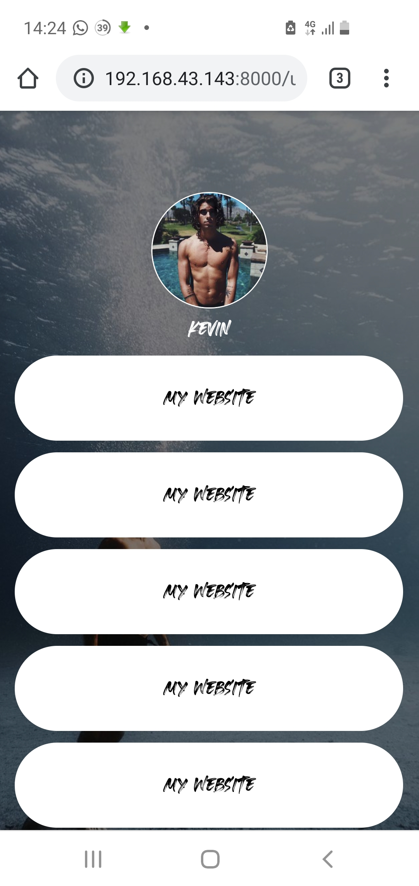
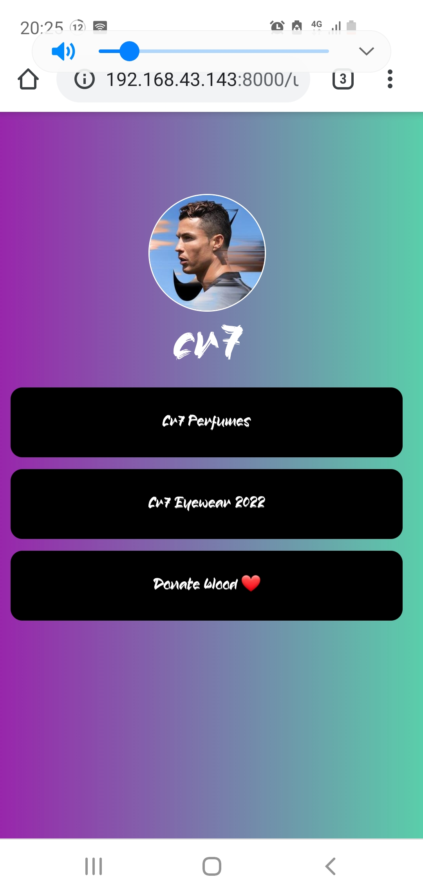
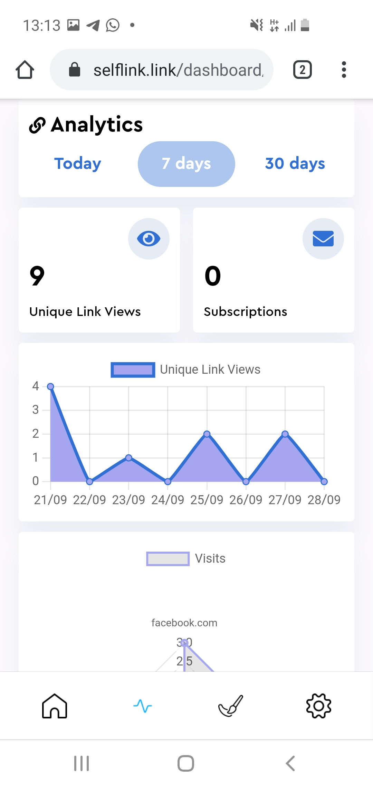
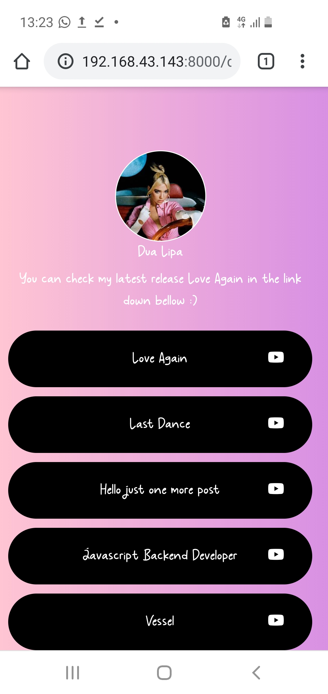

# Django Linktr.ee & Bit.ly Clone (with screenshots)
A link in bio platform plus URL shortening built with Django.
It has a dashboard that gives statistics such as link clicks, location and refferal channel.
This app has a free and a premium plan. It is freemium.
It has PayPal Subscription API integration

### Old Live Project
selflink.link

### Screenshots











### Installation and Usage

Open cmd in the projects directory (cmd/control + Shift) and type:
```
pip install -r requirements.txt

```
Create a config.ini file and assign a value to each of these variables:

```
[site]
secret_key = @+7zuz+g3+c3m$c9*khcth2rya_fa9$@5(3@0c6wq9@8pm(zb+

[sandbox]
cid = something
secret = something
access_token = something
product_id = something
plan_id = something
paypal_access_token_expire_date = something

[live]
cid = something
secret = something
access_token = something
product_id = something
plan_id = something
paypal_access_token_expire_date = something

[email]
email_host = something
email_host_password = something

[database]
engine = something
name = something
user = something
password = something
host = something

```

then in your cmd type:
```
python manage.py runserver

```
